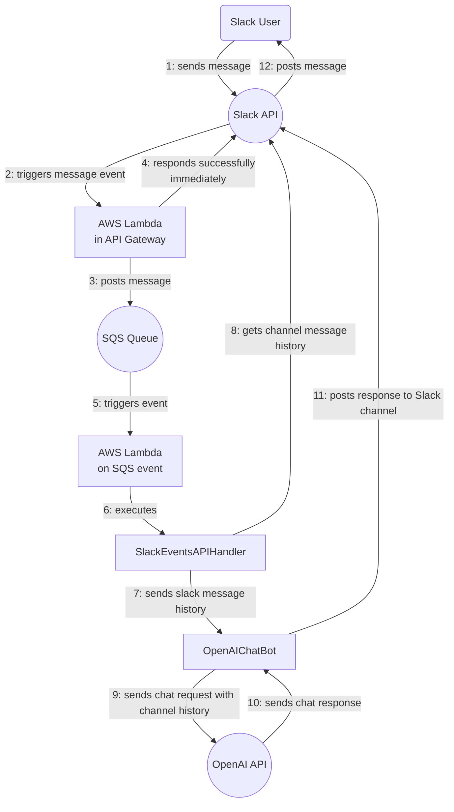

# Ruby Slack ChatOps Bot

A babbling bot that can do things for you.  Uses the Open AI chat API with
function calling.  Currently available through Slack, and soon through
Microsoft Teams.

## An AI agent framework

Babulus is a framework for building serverless AI agents in the form of
infrastructure-as-code applications managed by AWS CloudFormation.  Each
deployed bot includes a key-value store in DynamoDB for its settings caching
things and a message cache table for caching the conversation history.

Each bot instance also includes a CloudWatch dashboard showing high-level
application metrics and it can show you metric widget images from that dashboard
if you ask in the chat. These features are demonstrations of how to use the
function plugin system to give the agent access to your own app's CloudWatch
metrics and alerts so that you can set up a serverless copilot for your system.

What good are metrics and alerts without notifications?  And so, a Babulus bot's
alerts are connected to an SNS topic that will trigger a Lambda function that
will post a notification about the alert state changing to a Slack channel
that you specify.  You can connect your own alarms to that SNS topic to get
notified about them, too.

After you set up a Slack app and give it your bot's Slack Events API handler
URL, messages from Slack will trigger your bot's Lambda functions through API
Gateway and through an SQS queue for resliliency.

Your bot will then sit between Slack and the OpenAI API and will use its current
settings to craft requests and send them to the chat API.  The art in a chat
bot is in how you manage the tokens that you send to the language model, so
the "crafting" part is important.  You can start by customizing your default
system prompt, which is a parameter in AWS Systems Manager.

## Calling chat functions

As a demonstration of function calling, a Babulus bot can tell you about its own
CloudWatch metrics and show you metric widget images.  It has a plugin
architecture for adding custom chat functions for doing whatever you need.

## Overview

The application is based on AWS Lambda and is triggered by events from the Slack
Events API. This means that whenever a user posts a message in the linked Slack
channel, an event is sent to our Lambda function, which processes the event and
sends a response back to the Slack channel. The core processing logic is
encapsulated in a Ruby class called `Babulus::SlackEventsAPIHandler`.

The `Babulus::SlackEventsAPIHandler` class is responsible for parsing incoming
Slack events, dispatching them to the correct handler based on their type, and
returning the appropriate response. Currently, it supports two types of events:
`url_verification` and `message`.

The `url_verification` event is used by Slack to confirm that our endpoint is
operational and owned by us. When this event type is received, the class simply
echoes back the 'challenge' string provided in the event.

The `message` event type is triggered whenever a message is posted in the Slack
channel. When this event type is received, the class logs the message text and
sends a response back to the Slack channel. Currently, the response is simply a
mirror of the original message, but the plan is to replace this with a call to
the OpenAI API, so the response will be generated by GPT-4.

## Configuration

The application is configured to run in different environments (e.g.,
development, production) using configuration parameters stored in AWS Systems
Manager (SSM) Parameter Store, segmented by environment name.

Your Slack app access token and your OpenAI API token are secret, and so those
go in Secrets Manager.

## Operation

### Deployment

Replace the profile with your correct AWS profile, and provide the correct stack
name for your environment.
#### Production

    $ sam build && sam deploy --profile=330731243300_AdministratorAccess --region us-east-1 --config-env=production

#### Development

    $ sam sync --profile=AdministratorAccess-330731243300 --region us-east-1 --stack-name=babulus-development

### View logs

    $ sam logs -t --profile=AdministratorAccess-330731243300 --region=us-east-1 --stack-name=babulus-development

## Development

### Local invocation

    $ sam build && sam local invoke SlackEventsAPIHandlerHandlerFunction --event=events/slack_events_api_test_message.json --env-vars=env.json --profile=AdministratorAccess-330731243300

### Testing

The code includes a comprehensive suite of RSpec tests to ensure that it handles Slack events correctly. These tests cover the main event dispatching logic, as well as the individual handlers for the supported event types.

    bundle exec rake spec

You can use Guard to watch the code and run the specs when anything changes:

    bundle exec guard

## Contribution

Contributions to this project are welcome! Feel free to fork the repository and submit a pull request with your changes. Before submitting your pull request, please ensure that your changes pass the test suite and that you have added tests for any new functionality. Also, please update the README if necessary to reflect your changes.

## Credits

Most of the code and the README were written by ChatGPT, an AI model developed by OpenAI. You can view the conversation that resulted in this README [here](https://chat.openai.com/share/294e63c7-3398-4dc6-a353-6435c23fcd6a).
