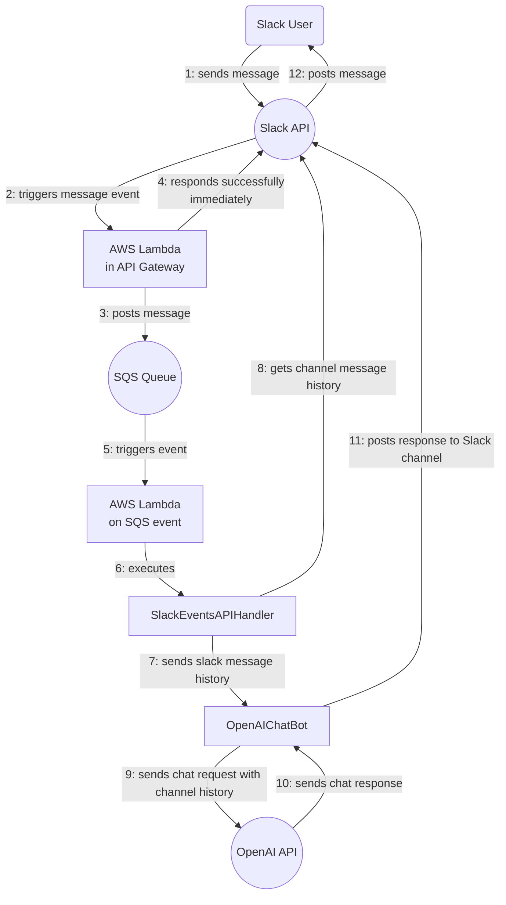

# Babulus

A serverless infrastructure-as-code artificial-intelligence agent that can report on your CloudWatch metrics and alarms via chat through Slack using the OpenAI chat API's function-calling features.  It has a key-value store for settings and cached stuff in DynamoDB and a message history cache for storing token estimates.  It includes a CloudWatch dashboard showing high-level application metrics and it can show you metric widget images from that dashboard if you ask in the chat.  These features are demonstrations of how to use the function plugin system to give the agent access to your own app's CloudWatch metrics and alerts so that you can set up a serverless copilot for your app.

## Overview

The application is based on AWS Lambda and is triggered by events from the Slack Events API. This means that whenever a user posts a message in the linked Slack channel, an event is sent to our Lambda function, which processes the event and sends a response back to the Slack channel. The core processing logic is encapsulated in a Ruby class called `SlackEventsAPIHandler`.

The `SlackEventsAPIHandler` class is responsible for parsing incoming Slack events, dispatching them to the correct handler based on their type, and returning the appropriate response. Currently, it supports two types of events: `url_verification` and `message`.

The `url_verification` event is used by Slack to confirm that our endpoint is operational and owned by us. When this event type is received, the class simply echoes back the 'challenge' string provided in the event.

The `message` event type is triggered whenever a message is posted in the Slack channel. When this event type is received, the class logs the message text and sends a response back to the Slack channel. Currently, the response is simply a mirror of the original message, but the plan is to replace this with a call to the OpenAI API, so the response will be generated by GPT-4.

## Architecture

This project is a serverless application based on the AWS Serverless Application Model (SAM). It uses AWS Lambda for running the application code in response to events, such as a new message in the Slack channel.  It also uses AWS SQS to asynchronously decouple the event receiving and processing stages into two separate Lambda functions: One for API Gateway to call when the Slack API sends an event, and the other to process the event asynchronously.

## Configuration

The application is configured to run in different environments (e.g., development, production) using environment variables and parameters stored in AWS Systems Manager (SSM) Parameter Store. The parameters are fetched at runtime and include the Slack App ID and Access Token.

## Operation

### Deployment

Replace the profile with your correct AWS profile, and provide the correct stack name for your environment.
#### Production

    $ sam build && sam deploy --profile=3307312433
00_AdministratorAccess --region us-east-1 --config-env=production

#### Development

    $ sam sync --profile=767678462952_AdministratorAccess --region us-east-1

### View logs

    $ sam logs -t --profile=330731243300_AdministratorAccess --region=us-east-1 --stack-name=ruby-slack-openai-chat-bot-development

## Development

### Local invocation

    $ sam build && sam local invoke SlackEventsAPIHandlerHandlerFunction --event=events/slack_events_api_test_message.json --env-vars=env.json --profile=AdministratorAccess-330731243300

### Testing

The code includes a comprehensive suite of RSpec tests to ensure that it handles Slack events correctly. These tests cover the main event dispatching logic, as well as the individual handlers for the supported event types.

  bundle exec rake spec

You can use Guard to watch the code and run the specs when anything changes:

  bundle exec guard

## Contribution

Contributions to this project are welcome! Feel free to fork the repository and submit a pull request with your changes. Before submitting your pull request, please ensure that your changes pass the test suite and that you have added tests for any new functionality. Also, please update the README if necessary to reflect your changes.

## Credits

Most of the code and the README were written by ChatGPT, an AI model developed by OpenAI. You can view the conversation that resulted in this README [here](https://chat.openai.com/share/294e63c7-3398-4dc6-a353-6435c23fcd6a).
